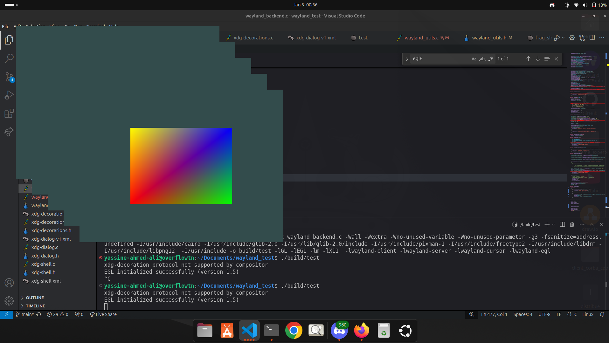

# OpenGL wayland rendering backend

This repo is for an OpenGL rendering backend built to support native wayland, soon to be integrated into GooeyGUI library.

# Wayland Backend Features

The table below lists the features supported by the Wayland backend, along with those planned for future implementation.

| Feature                          | Status       | Notes                                           |
|----------------------------------|--------------|------------------------------------------------|
| Wayland Protocol Support         | ✅ Implemented | Core Wayland protocol functionality.           |
| Multi-Window Support             | ✅ Implemented | Handles multiple windows with unique contexts. |
| EGL Integration                  | ✅ Implemented | EGL display, context, and surface management.  |
| OpenGL Rendering                 | ✅ Implemented | Full OpenGL rendering pipeline integration.    |
| Wayland Compositor Interaction   | ✅ Implemented | Supports Wayland compositor and registry.      |
| XDG-Shell Support                | ✅ Implemented | Includes xdg_surface and xdg_toplevel.         |
| Window Decorations               | ✅ Implemented | Server-side decorations via Wayland protocol.  |
| Shader Management                | ✅ Implemented | GLSL shader compilation and linking.           |
| High DPI Scaling                 | ⬜ Planned    | Support for high-resolution displays.          |
| Touchscreen Support              | ⬜ Planned    | Handle Wayland touch input events.             |
| Keyboard Input Handling          | ⬜ Planned    | Abstract Wayland keyboard input.               |
| Mouse Input Handling             | ⬜ Planned    | Abstract Wayland pointer input.                |
| Multi-Monitor Support            | ⬜ Planned    | Add support for multiple displays.             |
| Wayland Subsurface Support       | ⬜ Planned    | For advanced window compositing.               |
| Clipboard Integration            | ⬜ Planned    | Integrate Wayland clipboard features.          |
| Drag-and-Drop Support            | ⬜ Planned    | Enable drag-and-drop operations.               |
| Vulkan Rendering                 | ⬜ Planned    | Add Vulkan rendering alongside OpenGL.         |
| Debugging and Logging            | ⬜ Planned    | Enhanced error and event logging.              |
